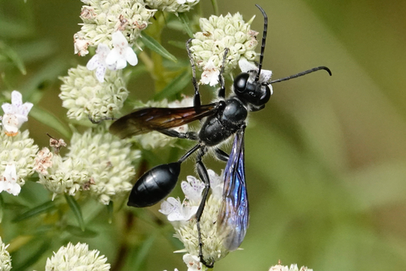
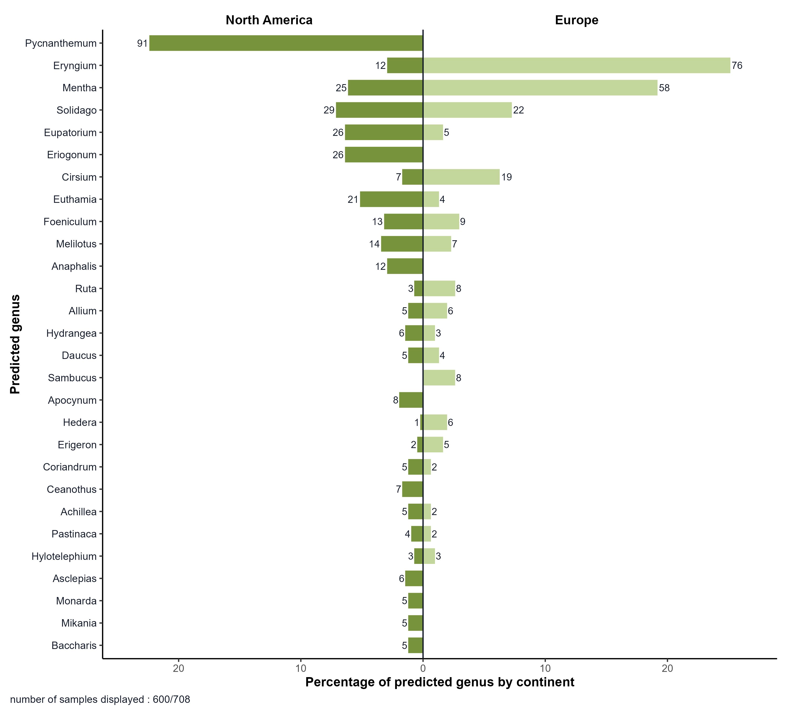
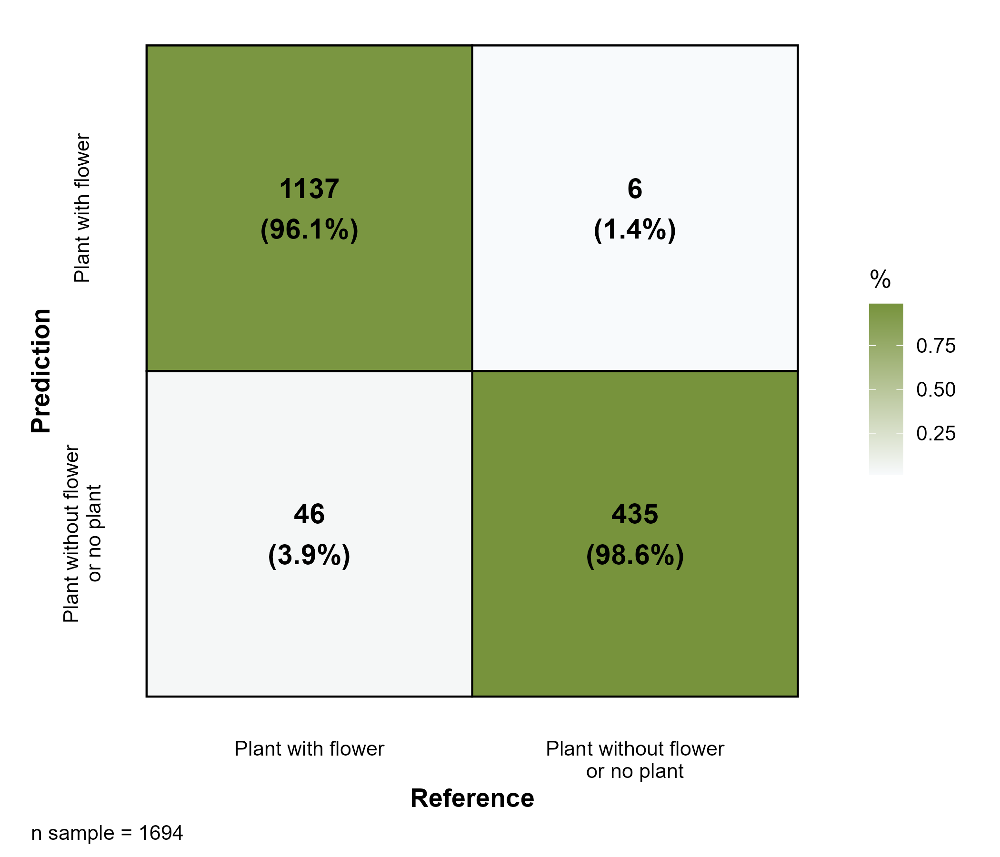

# Pl@ntNet API for plant-pollinator interactions

This repository contains an end-to-end R workflow to:
1. Fetch pollinator-related observations and metadata from iNaturalist.
2. Enrich observations with Pl@ntNet flora project information.
3. Run plant identification from observation images using Pl@ntNet.
4. Filter predictions for flower-based records and confidence thresholds.
5. Build summary outputs and visualization by geographic group.
6. Compare predictions to expert identifications and compute metrics.

## I. Description

### I.1 Objectif

<p align="justify">To illustrate the use of the Pl@ntNet API in XXXX et al. (XXXX), we have drawn inspiration from the approach described by <a href="https://doi.org/10.1002/ece3.11537">(Pernat et al., 2024)</a>: the identification of plants in images of insects sourced from iNaturalist, with a view to studying the relationships between plants and pollinators (<a href="#figure-1">Figure 1</a>). Here, we present a comprehensive and reproducible workflow, inspired by that of Pernat et al. (2024), but more advanced and more reproducible. This GitHub repository enables you to replicate the experiments described in the following two subsections. The code is thoroughly commented to enable the community to generate their own data for other species by specifying geographical coordinates and time periods.
</p>

<p align="center">
  <a id="figure-1"></a>
  
</p>

<p align="center"><strong>Figure 1</strong> : A photograph of Isodontia mexicana visiting flowers of Pycnanthemum tenuifolium posted to iNaturalist <a href="https://doi.org/10.1002/ece3.11537">(Pernat et al., 2024)</a>.</p>

### I.2. General operation

 <p align="justify">Our workflow begins with the automatic extraction of metadata, including the URLs of the first images, from all ‘scientific-quality’ observations of an insect species on iNaturalist for a specific time period and geographical area. In this example, we have compiled observations of Isodontia mexicana recorded between 2007 and 2021 in Europe and North America: 2,424 observations. The first image from each observation is automatically sent to the Pl@ntNet API in its original resolution via its iNaturalist URL. For each observation, the Pl@ntNet API indicates whether a plant has been detected. If so, the API returns a prediction of the visible organ (flower, leaf, whole plant, etc.) and a list of the five most likely plant species, along with their confidence scores. Using a confidence score threshold of 0.5 for classification as a ‘plant with a flower’, 1,633 records were identified as having a flower. Of these 1,633 observations, only those with a confidence score greater than 0.5 for taxonomic identification were retained, amounting to a total of 708 observations of insects on flowers: <a href="#figure-2">Figure 2</a>.</p>

<p align="center">
  <a id="figure-2"></a>
  
</p>

<p align="center"><strong>Figure 2</strong> : Predictions by the Pl@ntNet API of plant genera previously identified by the same API as having flowers in images of Isodontia mexicana published on iNaturalist between 2007 and 2021. Only genera with at least 5 occurrences are shown, representing 600 of the 708 observations. The values at the ends of the bars represent the total number of observations per continent.</a>.</p>

### I.3. Quality of workflow predictions

<p align="justify">To evaluate the performance of our workflow, we used the supplementary data provided by <a href="https://doi.org/10.1002/ece3.11537">(Pernat et al., 2024)</a> : isomex_experts.xlsx in <a href="https://doi.org/10.5281/zenodo.11185002">Pernat (2024)</a>. These contain expert annotations for 1,694 of the 2,424 observations of Isodontia mexicana extracted using our workflow. These data indicate the presence or absence of the plant and specify whether a flower is visible. The scientific name of the plant is also provided for 936 of these 1,694 expert observations. This enabled us to estimate that our workflow can distinguish observations containing a flower from other observations with a macro-precision of 0.97 and a weighted precision for flowers of 0.98 (<a href="#figure-3">Figure 3</a>). For observations classified as containing a flower, plant identification achieved a macro-precision with Bayesian smoothing of 0.88 for the genus and 0.92 for the family. It should be noted that only 45 per cent of the ‘plant with flower’ images were identified due to the retention threshold of 0.5, which reduced the number from 966 to 431. However, this significant loss of data is offset by the speed with which the data can be retrieved and processed: approximately 30 minutes on a standard laptop.</p>

<p align="center">
  <a id="figure-3"></a>
  
</p>

<p align="center"><strong>Figure 3</strong> : Prediction by the Pl@ntNet APIof whether or not a flower is present in the image.  A confidence score threshold of 0.5 was used for classification as a “plant with flower” below this threshold, the image is classified as “Plant without flower or no plant”.</p>


## II. Repository structure

- `config.yaml`: local configuration (e.g. your Pl@ntNet API key or script settings).
- `README.md` : GitHub README
- `inputs/`: source files. <strong>It contains the file isomex_experts_cor.csv, a modified version of isomex_experts.xlsx which corrects and aligns the taxonomy with that of Pl@ntNet.</strong>
- `utils/`: helper functions used by scripts.
- `scr/`: main R scripts for each pipeline step.
- `outputs/`: generated CSV files and plots (for default and test versions).
- `README_images/`: images for GitHub README.

## III. Requirements

<p align="justify">This workflow was created using R version 4.5.1 (2025-06-13 ucrt) and uses the following packages:</p>

- `config 0.3.2 2`
- `jsonlite 2.0.0 3`
- `dplyr 1.1.4 4`
- `httr 1.4.8 5`
- `ggplot2 3.5.2 6`
- `stringr 1.5.1 7`
- `tidyr 1.3.1`

<p align="justify">For install missing packages from R in optimal version:</p>

```yaml
install.packages("config",   version = "0.3.2")
install.packages("jsonlite", version = "2.0.0")
install.packages("dplyr",    version = "1.1.4")
install.packages("httr",     version = "1.4.8")
install.packages("ggplot2",  version = "3.5.2")
install.packages("stringr",  version = "1.5.1")
install.packages("tidyr",    version = "1.3.1")
```

<p align="justify"> Check that <strong>your project’s current directory is indeed at the root of this GitHub repository</strong> using getwd(). If this is not the case, take the necessary steps.</p>


## IV. Configuration and workflow execution

### IV.1. Reproduce the experiment

#### IV.1.1. Set up your configuration

 <p align="justify">To reproduce the results shown at the start, only one or two configuration settings are required. (1) You need to define your Pl@ntNet API key in the <code>config.yaml</code> at the root of the repository. <strong>Important, keep the key in quotes.</strong> (2) You need to set the <code>yaml_config</code> parameter to <code>default</code> or <code>test</code> in the <code>config.yaml</code> file. The default configuration is used to reproduce the results of the experiment, while the test configuration is used to run a limited number of observations and years. 

 <p align="justify"> <strong>/!\ Be sure to save <code>config.yaml</code> after making the changes.</strong></p>

```yaml
initialisation:
  yaml_config: your_yaml_config
  plantnet_api_key: "YOUR_API_KEY"
```

 <strong>With a free standard Pl@ntNet API key, the number of requests is limited to 200 per day. But, if you want to run the workflow with <code>default</code> configuration, you will need to make just under 2,500 requests using the script<code>1_1_identify_plantnet_top5.r</code>.</strong> To resolve this problem, you have three options.
1. You can request an increase in your daily query limit. You can do this free of charge, directly from your account page at my.plantnet.org.
2. The workflow with the <code>yaml_config: test</code> configuration can be run with a free standard Pl@ntNet API key, as it is limited to 51 requests. But it’s just a test to see if it works
3. You can skip the first few steps of the workflow and start running it from the <code>scr/1_3_histogram_pred_by_area.r</code> script (see the next subsection), as the necessary files have already been pre-generated in the <code>out</code> directory</p>

#### IV.1.2. Run the workflow

Run scripts from the project root, in this order:

1. `scr/0_1_inat_data_creation.r`: Fetches iNaturalist observations for the target species and exports metadata plus image URLs to CSV.
2. `scr/1_1_identify_plantnet_top5.r`: Sends each image to the Pl@ntNet API and stores top-5 taxonomic predictions with organ and confidence scores.
3. `scr/1_2_filter_indentify_plantnet_top5.r`: Filters predictions to flower observations with rank-1 and confidence threshold, then exports filtered and summary tables.
4. `scr/1_3_histogram_pred_by_area.r`: Builds a comparative histogram of predicted taxa between two geographic groups (for example Europe vs North America).
5. `scr/2_1_add_experts_info.r`: Merges Pl@ntNet predictions with expert annotations for the observations that have reference labels.
6. `scr/2_2_metric_organ.r`: Computes organ-level performance metrics and generates the confusion matrix plot between predicted and expert organ classes.
7. `scr/2_3_metric_taxon.r`: Computes genus/family accuracy metrics (micro, macro, and Bayesian-smoothed macro) and exports per-observation and per-group results.

### IV.2. Run your own experiments

 <p align="justify">You can run your own experiments on species of your choice, across different geographical areas and time periods. To do this, you will need to read the description section for each script and modify the parameters in the <code>config.yaml</code> file.</p>
 
 <p align="justify">The last three scripts presented in the previous subsection (<code>2_1_add_experts_info.r</code>, <code>2_2_metric_organ.r</code>, and <code>2_3_metric_taxon.r</code>) cannot be run as they use isomex_experts_cor.csv, which is specific to our experiment.</p>

 <p align="justify">Finally, you can run the optional script <code>scr/0_2_add_plantnet_flora.r</code> immediately after <code>scr/0_1_inat_data_creation.r</code> if you use <code>project_type <- "auto"</code> later (see description in <code>scr/0_2_add_plantnet_flora.r</code> and in <code>config.yaml</code>).</p>

## V. Main outputs

- Fetched data: `outputs/fetched_data/*.csv`
- Raw Pl@ntNet predictions: `outputs/predicted_files/*.csv`
- Filtered and evaluation outputs: `outputs/analysis/*.csv`
- Figures: `outputs/analysis/*.png`

## References

- XXXXXX, X., XXXXXX, X,. XXXXXX, X., XXXXXX, X. (XXXX). Pl@ntNet automated identification service: enabling automated biodiversity monitoring through large-scale plant identification. XXXXXXXXX, XXX,XX. https://doi.org/XXXXXXX
- Pernat, N., Memedemin, D., August, T., Preda, C., Reyserhove, L., Schirmel, J., & Groom, Q. (2024). Extracting secondary data from citizen science images reveals host flower preferences of the Mexican grass-carrying wasp Isodontia mexicana in its native and introduced ranges. Ecology and Evolution, 14(6), e11537. https://doi.org/10.1002/ece3.11537 
- Pernat, N. (2024). iNaturalist-Pl@ntNet workflow (Version 0.1.0) [Computer software]. Zenodo. https://doi.org/10.5281/zenodo.11185002
